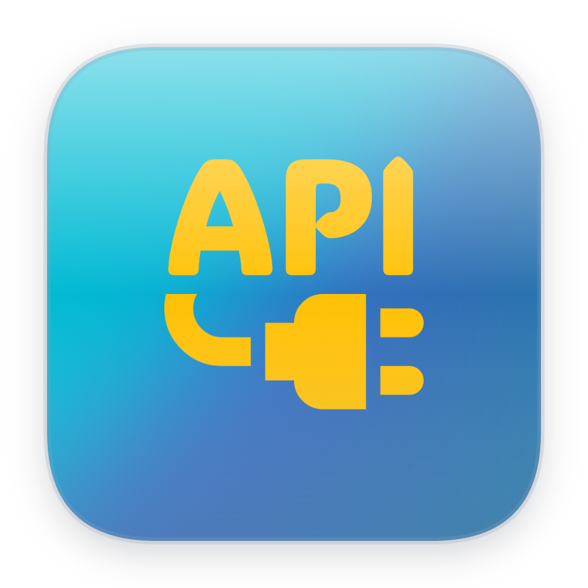
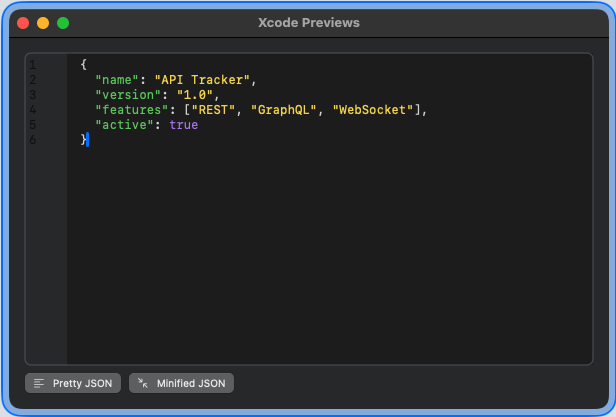
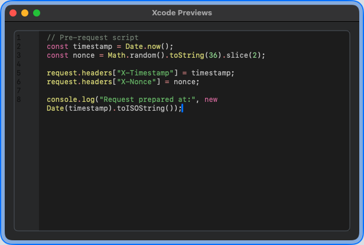
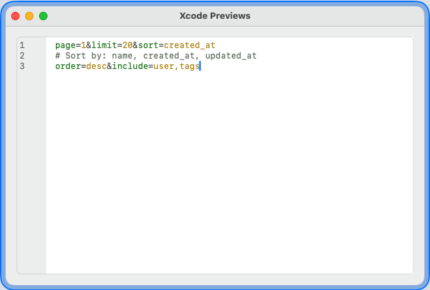
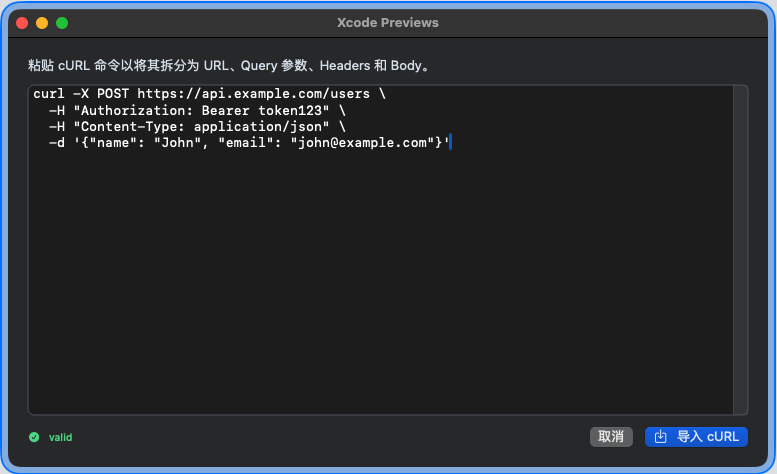

# API Tracker — macOS API Client & Development Toolkit

<p align="center">
  
</p>

<p align="center">
  <strong>A modern, native macOS API client built with SwiftUI.</strong><br>
  Design, test, monitor, and document REST APIs, GraphQL endpoints, and WebSocket connections — all from a single application.
</p>

> ⚠️ **API Tracker is currently in active development and not yet available on the App Store.**  
> We are open-sourcing four core editor components ahead of the full release. Contributions and feedback are welcome!

---

## Table of Contents

- [Key Features](#key-features)
- [Open-Source Editor Components](#open-source-editor-components)
  - [1. JSON Editor](#1-json-editor)
  - [2. Script Editor](#2-script-editor)
  - [3. Query Parameter Editor](#3-query-parameter-editor)
  - [4. cURL Editor](#4-curl-editor)
- [Usage (Adding to Your Xcode Project)](#usage-adding-to-your-xcode-project)
- [Requirements](#requirements)
- [Roadmap](#roadmap)
- [License](#license)

---

## Key Features

### 🚀 API Workspace & Request Builder
Organize your API endpoints into workspaces, groups, and folders. Build HTTP **REST API** requests with full support for **GET**, **POST**, **PUT**, **PATCH**, **DELETE**, **HEAD**, and **OPTIONS** methods. Manage query parameters, headers, authorization (Basic Auth, Bearer Token, API Key), and request body types (**JSON**, Form Data, Raw).

### 📡 GraphQL Client & WebSocket Testing
Beyond REST, API Tracker includes built-in support for **GraphQL** queries and mutations, as well as **WebSocket** connections for real-time API testing and debugging.

### 🔍 Response Viewer & JSON Formatter
Inspect responses with a multi-tab viewer covering raw body, syntax-highlighted **JSON formatter**, response headers, cookies, and a detailed timeline showing DNS, TLS, and transfer breakdowns.

### 📊 API Monitoring & Network Dashboard
Set up automated monitoring with configurable intervals and expected status codes. Track **network performance** metrics including response times, success rates, and error statistics through a live dashboard.

### ✨ Syntax-Highlighted Code Editors
All text editors feature real-time **syntax highlighting** with line numbers, powered by a custom `NSTextView`-based rendering engine. Supports JSON, JavaScript, and key-value query formats.

### 🐚 cURL Import
Paste any **cURL** command and instantly parse it into a fully-configured request — URL, method, headers, query parameters, body, and authorization settings are all extracted automatically.

### 📝 Pre-Request & Post-Response Scripts
Write JavaScript **script editor** logic to dynamically modify requests before sending or process responses after receiving them.

### 🍪 Session Management
Manage cookies across requests with a built-in cookie jar viewer, making it easy to work with authenticated APIs.

### 🛠️ Developer Utilities
Built-in developer tools include a JSON/Base64 encoder-decoder, JWT debugger, and **QR code** generator/scanner for API consumption shortcuts.

### 🎨 Modern macOS-Native Design
Fully native SwiftUI interface with dark mode support, responsive split-pane layouts, and adherence to Apple's Human Interface Guidelines.

---

## Open-Source Editor Components

The following four editor components are extracted from API Tracker and released as independent, self-contained modules. Each is **drop-in ready** — just copy the folder into your Xcode project, and it will compile without any external dependencies.

| Component | Description | Lines of Code |
|-----------|-------------|---------------|
| [JSON Editor](#1-json-editor) | Syntax-highlighted JSON editor with Pretty/Minified formatting | ~300 |
| [Script Editor](#2-script-editor) | JavaScript editor with keyword, string, and comment coloring | ~340 |
| [Query Editor](#3-query-parameter-editor) | Key=value parameter editor with distinct key/value colors | ~100 |
| [cURL Editor](#4-curl-editor) | Full cURL command parser, tokenizer, and validator | ~370 |

All editors are built on top of a shared `lineNumberEditor` — a custom `NSViewRepresentable` wrapping `NSTextView` with a fixed-width line-number gutter and real-time syntax highlighting.

---

### 1. JSON Editor

A code editor for JSON content with **syntax highlighting** and one-click Pretty/Minified formatting.



**Features:**
- Real-time syntax highlighting: keys (green), strings (yellow), numbers (purple), booleans/null (purple), punctuation (gray)
- Fault-tolerant: a syntax error on one line won't break subsequent lines
- Built-in line numbers
- **Pretty Print** — formats JSON with indentation and sorted keys
- **Minify** — compresses JSON into a single line

**Usage:**

```swift
import SwiftUI

struct ContentView: View {
    @State private var jsonText = """
    {"name":"API Tracker","version":"1.0"}
    """

    var body: some View {
        JsonEditorView(text: $jsonText)
            .frame(minWidth: 500, minHeight: 400)
    }
}
```

---

### 2. Script Editor

A JavaScript/script editor designed for **pre-request** and **post-response** scripting scenarios.



**Features:**
- Supports JavaScript keywords (`const`, `let`, `function`, `if`, `return`, `async`, `await`, etc.)
- Identifiers highlighting for built-in objects (`console`, `JSON`, `request`, `response`, `variables`)
- String coloring (single quote, double quote, template literal)
- Comments: line comments (`//`) and block comments (`/* */`)
- Operator and number coloring
- Customizable placeholder text
- Word-wrap mode for long scripts

**Usage:**

```swift
ScriptEditorView(
    text: $scriptText,
    placeholder: "Write your pre-request script..."
)
.frame(minWidth: 500, minHeight: 300)
```

---

### 3. Query Parameter Editor

A lightweight editor for **URL query parameters** in `key=value` format with `&` separators.



**Features:**
- Key coloring (green) vs. value coloring (yellow)
- `&` separator highlighting
- Comment support: lines starting with `#` are dimmed
- Word-wrap mode for long query strings

**Usage:**

```swift
@State private var queryText = """
page=1&limit=20&sort=created_at
"""

QueryBulkEditorView(text: $queryText)
    .frame(minWidth: 500, minHeight: 200)
```

---

### 4. cURL Editor

A self-contained **cURL command importer** that validates, tokenizes, and parses cURL commands into structured request components.



**Features:**
- Paste any **cURL** command (including multi-line `\` continuations)
- Real-time validation with feedback
- Parses: URL, HTTP method, headers, query parameters, request body, authorization
- Handles: `-X`, `-H`, `-d`, `-u`, `-b`, `--get`, `--head`, `--url`, `--data-raw`, `--data-binary`
- Tokenizer handles quotes (single, double), escaped characters, and inline apostrophes

**Usage:**

```swift
@State private var curlText = """
curl -X POST https://api.example.com/users \\
  -H "Authorization: Bearer token123" \\
  -d '{"name": "John"}'
"""

CurlEditorView(
    commandText: $curlText,
    onCancel: { /* dismiss */ },
    onImport: { rawCommand in
        // Use raw cURL text
        // Or parse with CurlEditorService:
        let result = try? CurlEditorService().importCommand(rawCommand)
    }
)
.frame(width: 800, height: 500)
```

---

## Usage (Adding to Your Xcode Project)

1. **Copy the `Sources/` folder** into your Xcode project.
2. Ensure all `.swift` files are added to your target's **Compile Sources**.
3. No external dependencies required — everything is self-contained using only `SwiftUI` and `Foundation`.

### File Structure

```
Sources/
├── Dependencies.swift          # Color extensions, theme constants, request models
├── EditorComponents.swift      # HighlightToken model, lineNumberEditor view
├── CurlEditor/
│   ├── CurlEditorView.swift    # cURL import UI
│   └── CurlEditorService.swift # cURL parser, tokenizer, validator
├── JsonEditor/
│   ├── JsonEditorView.swift    # JSON editor with formatting
│   └── JsonHighlightService.swift # JSON syntax highlighting
├── QueryEditor/
│   ├── QueryBulkEditorView.swift   # Query parameter editor
│   └── QueryHighlightService.swift # Key=value syntax highlighting
└── ScriptEditor/
    ├── ScriptEditorView.swift      # JavaScript editor
    └── ScriptHighlightService.swift # JavaScript syntax highlighting
```

### Xcode Previews

All four editor views include built-in `#Preview` blocks. Open any editor file in Xcode, and the canvas will show an interactive preview with sample content — no need to build and run the app.

---

## Requirements

| Component | Minimum Version |
|-----------|----------------|
| macOS | 14.0 (Sonoma) |
| Xcode | 15.0+ |
| Swift | 5.9+ |
| Deployment Target | macOS 14.0 |

---

## Roadmap

- [ ] App Store submission
- [ ] Environment variables management
- [ ] API collection import (Postman, Insomnia, OpenAPI)
- [ ] Response diff viewer
- [ ] Request chaining and data extraction
- [ ] Team workspace sharing
- [ ] HTTP/2 and HTTP/3 support

---

## License

The Editor Components (`Sources/`) are released under the **MIT License**. See [LICENSE](LICENSE) for details.

The full API Tracker application source code is currently proprietary. We plan to evaluate broader open-source licensing options after the App Store launch.

---

<p align="center">
  Made with ❤️ for macOS developers who build and test APIs every day.
</p>
